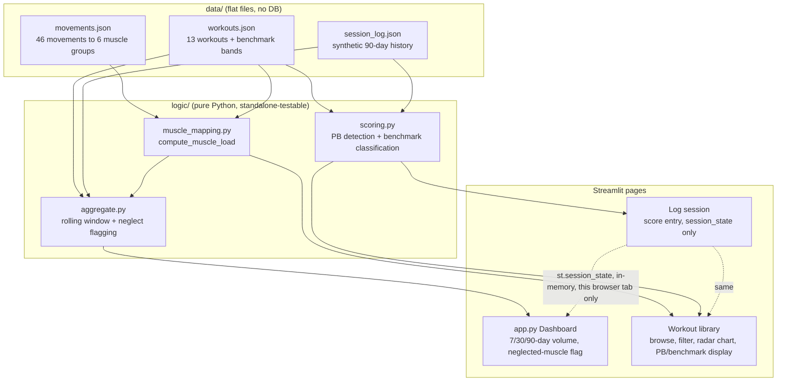

# Crossfit Muscle Balance Tracker

A Streamlit app that analyzes which muscle groups your Crossfit training has
actually emphasized over time, and flags what's been neglected. Built as a
sample-dataset demo (V1) — no database, no user accounts, everything runs
off flat files that ship with the repo.

**The core idea**: individual workout trackers tell you *what* you did.
This tells you what your training has *added up to* — which muscle groups
are getting real volume and which ones are quietly being skipped, based on
your actual logged history rather than any single workout in isolation.

## Features

- **Dashboard** — rolling 7/30/90-day muscle group volume, with
  under-trained muscle groups automatically flagged
- **Workout library** — browse 13 real workouts (CrossFit Girls, Hero WODs,
  and the last two years of CrossFit Open), filter by category/format/muscle
  group, and drill into any workout's full muscle-load radar chart
- **Log session** — log a workout + date + score; see your PB if you've
  logged this workout before, or public benchmark ranges (beginner →
  elite) if you haven't

## Tech stack

- **Streamlit** — UI framework, multi-page app
- **Plotly** — radar and bar charts
- **Plain JSON files** — all data (no database in V1 — see [Known
  limitations](#known-limitations--v1-honest-caveats))
- **Python standard library only** in the logic layer — no external
  dependencies beyond `streamlit`/`plotly`, so the core logic is trivially
  testable without spinning up the app

## Project structure

```
crossfit-tracker/
├── app.py                      # Dashboard (main/landing page)
├── pages/
│   ├── 1_Workout_library.py    # Browse + filter + single-workout detail
│   └── 2_Log_session.py        # Log a session, see PB/benchmark status
├── logic/                      # Pure Python, no Streamlit dependency —
│   │                           # every function here is standalone-testable
│   ├── muscle_mapping.py       # movement -> muscle group load calculation
│   ├── aggregate.py            # rolling-window volume + neglect flagging
│   └── scoring.py              # PB detection + benchmark classification
├── data/
│   ├── movements.json          # 46 movements -> 6 muscle groups (weighted)
│   ├── workouts.json           # 13 workouts, incl. score_type + benchmarks
│   ├── session_log.json        # synthetic 90-day session history (demo data)
│   ├── SCHEMA.md                # workout data schema + design decisions
│   └── BENCHMARKS.md            # sources for the benchmark time/score bands
├── scripts/
│   └── generate_sample_log.py  # regenerates the synthetic session log
└── requirements.txt
```

## Architecture

Three clean layers: **data** (flat files) → **logic** (pure Python,
Streamlit-agnostic) → **pages** (thin UI wiring). Every function in `logic/`
was tested standalone from the command line before being wired into any
Streamlit page — this kept UI bugs and logic bugs from being debugged at
the same time.



## How muscle load is calculated (current, pre-intensity-weighting)

For each movement in a workout, `movements.json` gives a weight per muscle
group (1.0 = primary mover, down to 0.25 = minor secondary). A workout's
muscle load is the sum of its movements' weights. If a movement appears as
multiple separate entries (e.g. a wall-ball pyramid written as 7 steps),
each entry's weight stacks — this is intentional (see `data/SCHEMA.md`),
giving a rough proxy for volume without full rep-count math.

**This does not yet account for**: movement difficulty (a pull-up and a
muscle-up currently count the same toward "back load"), rep-capacity
differences between movements (300 squats vs. 100 pull-ups aren't
equivalent effort), or performance intensity (a fast, hard Murph vs. a
slow, easy one count identically). The PB/benchmark scoring system
(`logic/scoring.py`) was just built specifically to enable the next step —
weighting muscle load by how a session's score compares to the athlete's
own PB — but that wiring **has not been done yet**. Scoring and muscle-load
calculation are currently two separate systems that both read the same
session log but don't talk to each other.

## Known limitations / V1 honest caveats

- **No persistence** — `Log session` writes to `st.session_state` only.
  Refreshing the page or opening a new tab loses anything logged. This was
  a deliberate choice — V2 is Supabase.
- **Neglected-muscle threshold is arbitrary** — flags a muscle group if its
  volume is under 40% of the average across all groups. Simple and
  explainable, but not derived from any sports-science standard, and it's
  relative-only (can't flag "everything is under-trained" if overall
  volume is just low).
- **Benchmark bands only exist for 7 of 13 workouts** — the CrossFit Girls
  and Hero WODs have real, sourced community benchmark data (see
  `BENCHMARKS.md`). The 6 Open workouts (25.1-26.3) have none, by design —
  Open workouts are scored via leaderboard percentile, not descriptive time
  bands, so a fabricated-looking number would be worse than an honest gap.
- **The synthetic session log's scores are fabricated** (needed something
  to demo against), but the benchmark bands they're compared to are real.
- **Repeated movement entries stack** in a way that isn't fully consistent
  across workouts — see the design-decision note in `SCHEMA.md`.

## V2 roadmap (not built)

- Wire PB/benchmark intensity into muscle-load weighting (the change this
  README was written just before)
- Movement difficulty / skill-tier coefficients (pull-up vs. muscle-up)
- Real persistence via Supabase (free-tier Postgres), replacing
  `st.session_state`
- Rep-capacity-relative volume normalization

## Local setup

```bash
python -m venv venv
source venv/bin/activate      # Windows: venv\Scripts\activate
pip install -r requirements.txt
streamlit run app.py
```

Opens at `localhost:8501`. No database, no accounts, no API keys needed —
it runs entirely off the files in `data/`.

## Data sources

- Workout definitions: standard CrossFit benchmark workouts (Girls, Hero
  WODs) and the last two years of CrossFit Open (25.1-26.3), verified via
  web search against multiple sources at build time
- Benchmark time/score bands: see `data/BENCHMARKS.md` for full citations
- Movement to muscle group mapping: authored for this project, not sourced
  from an external database
